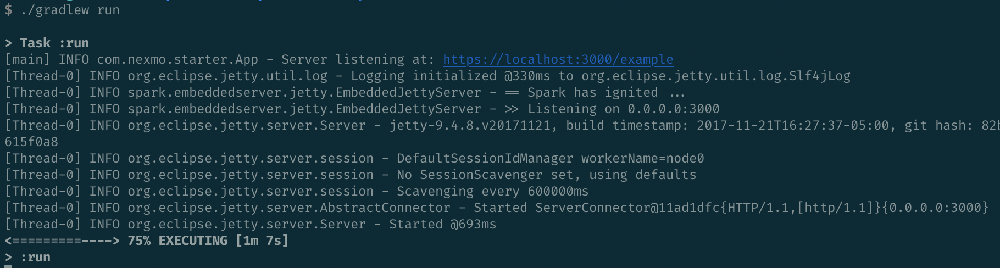

# Spark Starter Java

This repository contains code that can be used to integrate the [Nexmo Java Client Library](https://github.com/Nexmo/nexmo-java) and the [Spark Framework](http://sparkjava.com/).

## Deploy to Heroku
[](https://nexmo.dev/nexmo-spark-java-heroku)

## How to Manually Use
First clone the repository into a directory of your choosing:

```sh
git clone https://github.com/nexmo-community/spark-starter-java.git
```

Now navigate to the directory and start the application using [Gradle](https://gradle.org/).

Linux, Mac:
```sh
./gradlew run
```

Windows:
```sh
./gradlew.bat run
```



## How to Modify

All of the code can be found in the `com.nexmo.starter.App` class:

```java
package com.nexmo.starter;

import spark.Route;

import static spark.Spark.*;

public class App {
    public static void main(String[] args) {
        // Sample GET Request Route
        Route getExampleRoute = (req, res) -> "Hello world!";

        // Sample POST Request Route
        Route postExampleRoute = (req, res) -> "Hello world!";

        // Set the listening port to 3000
        port(3000);

        // Register the routes
        get("/example", getExampleRoute);
        post("/example", postExampleRoute);
    }
}
```

This class sets up a route listening for a GET and a route listening for a POST request on the `https://localhost:3000/example` path.

Any `String` that you return in each `Route` will be sent back to the user.

### Responding with an NCCO

The [Nexmo Voice API](https://developer.nexmo.com/voice/voice-api/overview) uses [Nexmo Call Control Objects (NCCO)](https://developer.nexmo.com/voice/voice-api/guides/ncco) to modify the flow of a call.

For example, if you wanted to create a voice proxy (where you connect your Nexmo number to another number), you can modify `App` to this:

```java
package com.nexmo.starter;

import com.nexmo.client.voice.ncco.ConnectAction;
import com.nexmo.client.voice.ncco.Ncco;
import com.nexmo.client.voice.ncco.PhoneEndpoint;
import com.nexmo.client.voice.ncco.TalkAction;
import spark.Route;

import static spark.Spark.get;
import static spark.Spark.port;

public class App {
    private static final String RECIPIENT_NUMBER = "15555551234";
    private static final String NEXMO_NUMBER = "18885551234";

    public static void main(String[] args) {
        Route answerRoute = (req, res) -> {
            TalkAction intro = new TalkAction.Builder("Please wait while we connect you").build();
            ConnectAction connect = new ConnectAction
                    .Builder(new PhoneEndpoint.Builder(RECIPIENT_NUMBER).build())
                    .from(NEXMO_NUMBER)
                    .build();

            res.type("application/json");
            return new Ncco(intro, connect).toJson();
        };

        port(3000);
        get("/webhooks/answer", answerRoute);
    }
}
```

From here you would then use something like [ngrok](https://ngrok.com/) to expose your server.

## More Information
For more information:
- Nexmo: https://developer.nexmo.com
- Spark Framework: http://sparkjava.com/


